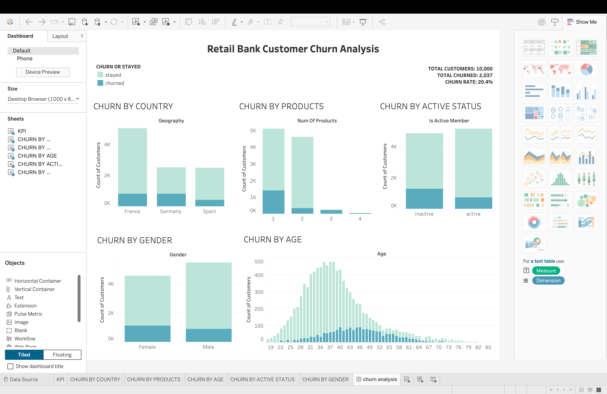

# Retail Bank Customer Churn Analysis

An end-to-end data analysis project exploring customer churn behavior in retail banking to identify risk factors and support retention strategies.

## Project Workflow

1. **SQL Analysis (MySQL):** Loaded the raw banking dataset into MySQL, created the required table, and performed initial analysis using SQL queries.

2. **Data Cleaning & Exploration (Python):** Imported the data into Jupyter Notebook for data validation, cleaning, and exploratory analysis. Converted currency-formatted fields such as `Balance` and `EstimatedSalary` from string values to numeric data types.

3. **Data Visualization (Tableau):** Built an interactive dashboard to visualize key performance indicators, regional risk factors, customer segments, and churn demographics using the processed data.

## Files in this Repository

- `raw_churn_data.sql`: SQL table creation, data loading, and analysis queries.
- `analysed_churn_data.ipynb`: Jupyter Notebook containing Python data cleaning and exploratory analysis.
- `cleaned_churn_data.csv`: Processed dataset used for analysis and visualization.
- `dashboard.png`: Screenshot of the final Tableau dashboard.

## Tableau Dashboard Preview

## Key Insights

- **Baseline Churn:** The overall customer churn rate is approximately 20.4% (2,037 out of 10,000 customers).
- **Geographic Trends:** Germany shows a noticeably higher churn rate relative to France and Spain.
- **Product Engagement:** Customers with one product show a higher churn rate than customers with two products.
- **Member Engagement:** Inactive members exhibit a higher churn rate, highlighting an opportunity for targeted re-engagement strategies.
